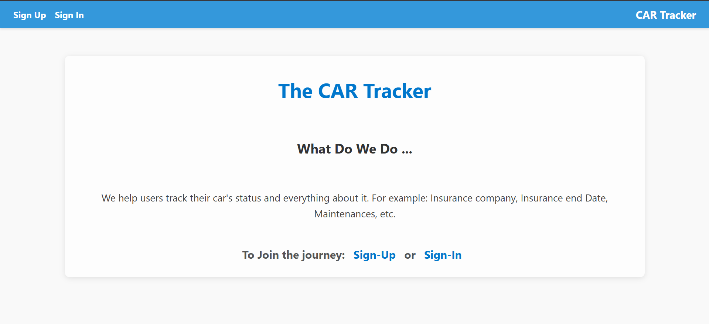

# 🚗 THE CAR TRACKER

## Description

**The Car Tracker** is a web application that helps users track and manage all important information about their cars in one place. Users can store details such as insurance company, insurance end date, maintenance records, and more.

---

## Features

* Add a new car to the collection
* Edit existing car information
* Delete car information from the collection

---

## Technologies Used

* **JavaScript (Node.js)**
* **CSS**
* **EJS**
* **MongoDB & Mongoose**
* **bcrypt**

---

## Attributions

* ChatGPT
* W3Schools
* Salman Murtaza
* Denis Sanchez Dujota
* Omar Kamal

---

## Next Steps

* Allow users to publish their cars for other users to view
* Give users control over what information is visible on the public car page (e.g., number plate, car model, manufacturer, etc.)

---

## Project Repository

🔗 GitHub: [https://github.com/Saeedzxz123/project-2-car-traker](https://github.com/Saeedzxz123/project-2-car-traker)

